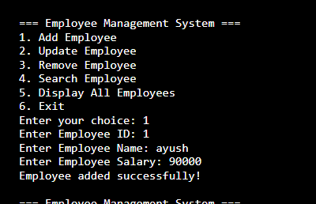
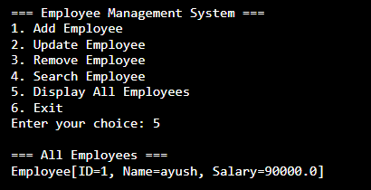
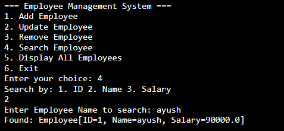

# EmployeeManagement.md

## Problem Statement 🎯
Develop a Java program to implement an ArrayList that stores employee details (ID, Name, and Salary). Allow users to perform the following operations:

- Add employees
- Update employee details
- Remove employees
- Search for employees

## Code
[EmployeeManagement.java](EmployeeManagement.java)

## Outputs

### Add Employee

### Display All Employees

### Search for Employees
