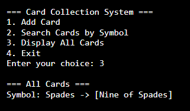

# CardCollectionSystem.md

## Problem Statement 🎯

Create a program to collect and store all the playing cards (e.g., hearts, spades, diamonds, clubs) and assist users in finding all the cards of a given symbol using the Collection interface.

## Output

### Add Card

### Display all Cards

